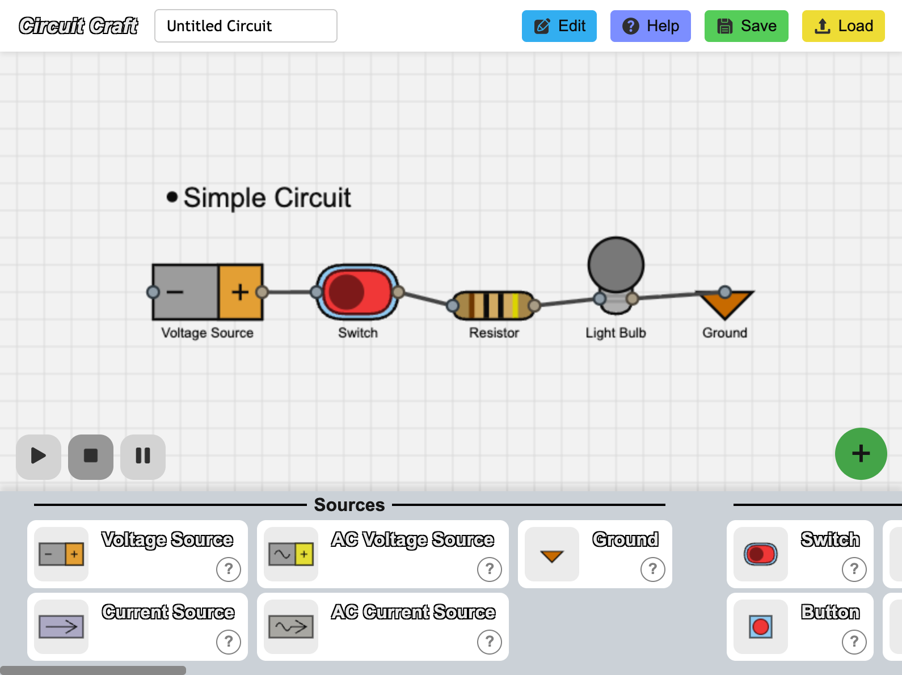

# Circuit Craft

Built with HTML, CSS, and JavaScript.

## Quick View

[View Circuit Craft On Vercel](https://circuit-craft-rust.vercel.app)

## Features

- HTML5 Canvas rendering
- Drag-and-drop for componenets
- Wire connection handling
- Help section
- Saving and loading

## Lessons Learned

- Multiple scripts would have made organization easier
- Static websites are faster and are used on non-interactive websites

## Preview



## Getting Started

1. Clone the repo:
   ```bash
   git clone https://github.com/SilentViewer807/Circuit-Craft.git
   ```
2. Navigate to the project directory:
   ```bash
   cd Circuit-Craft
   ```
3. Install dependencies:
   ```bash
   npm install
   ```
4. Build the static site files:
   ```bash
   npm run build
   ```
5. Run the static server
   ```bash
   npm run preview
   ```

## License

This project is open source and available under the MIT License.
